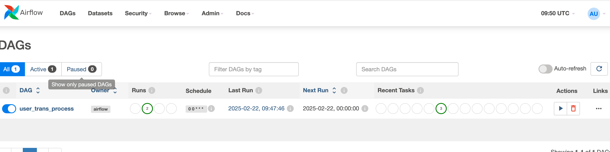
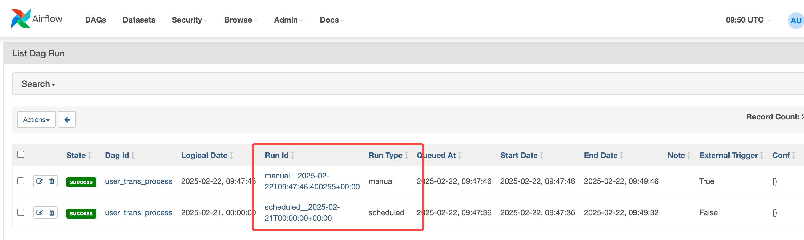
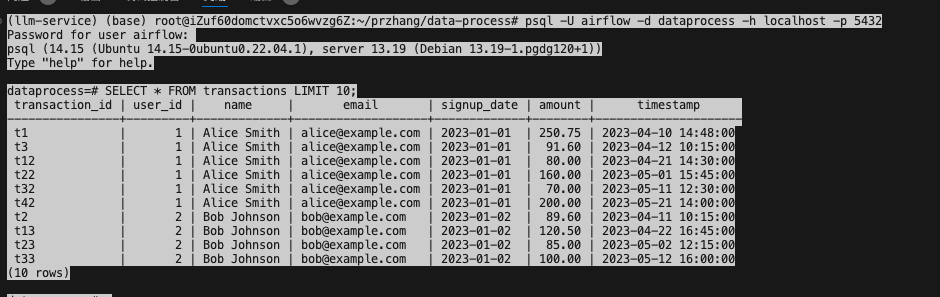
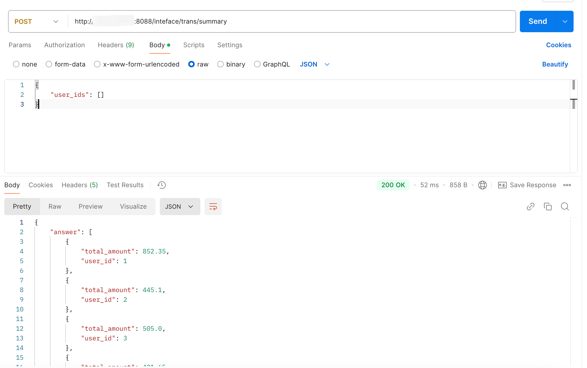
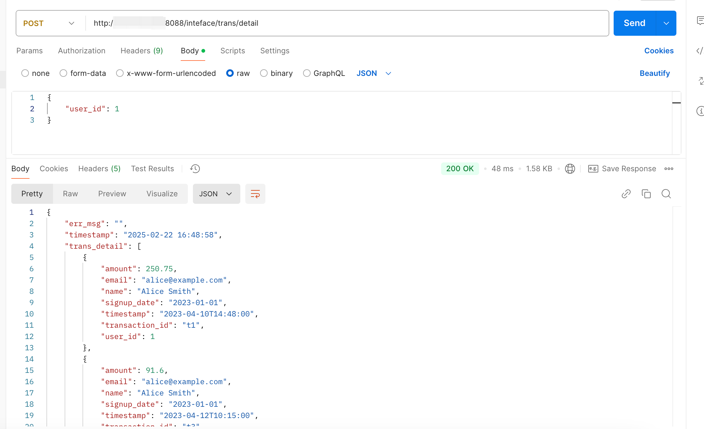

# data-process
IM data etl process
## 项目目录层级说明
/dags 路径存储airflow dag，挂载至airflow用于每日定时任务触发

/data 文件路径存储test数据，分别为userinfo和transdetail，并挂载至airflow

/data-intefence为flask应用，封装数据检索接口，提供服务

docker-compose文件为项目部署文件

## 系统部署
### 1. 构建自定义airflow镜像，安装以来
```bash
cd data-inteface
docker build -t airflow-own:v0.1 .
```
### 2. 启动psql和airflow服务
```bash
# 启动postgresql服务
docker-compose up -d postgres
# 初始化 Airflow 数据库
docker-compose run airflow-webserver airflow db init
# 创建一个管理员用户以便登录 Airflow Web UI
docker-compose run airflow-webserver airflow users create \
    --username admin \
    --password admin \
    --firstname Admin \
    --lastname User \
    --role Admin \
    --email admin@example.com
# 使用 Docker Compose 启动所有服务
docker-compose up -d
```

### 3. 构建数据查询后台服务镜并启动服务
```bash
cd data-process/data-intefence
docker build -t data-search:v0.1 .
cd ..
docker-compose up flask-app -d
```


## 系统运行截图
airflow dag_run execute status


psql database

Retrieve a list of users with their total transaction amounts.

Retrieve transaction details for a specific user.
